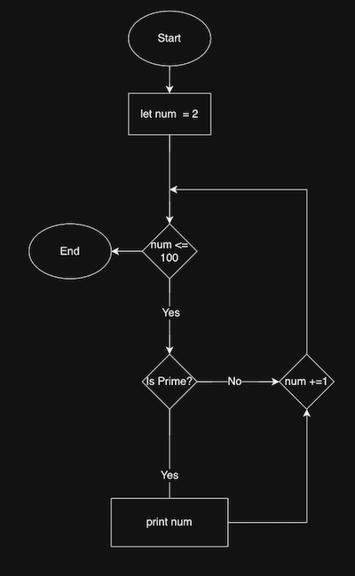
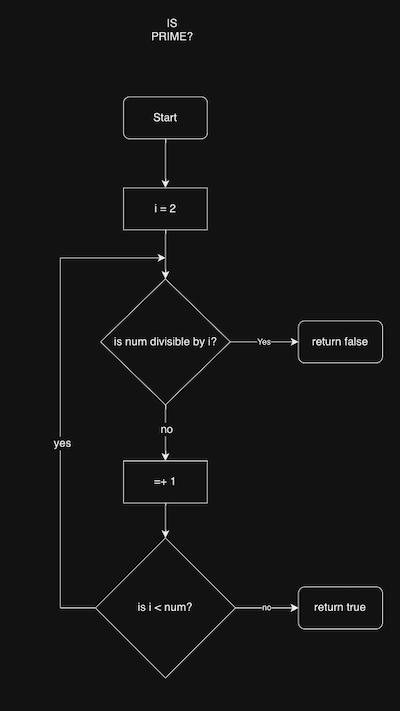
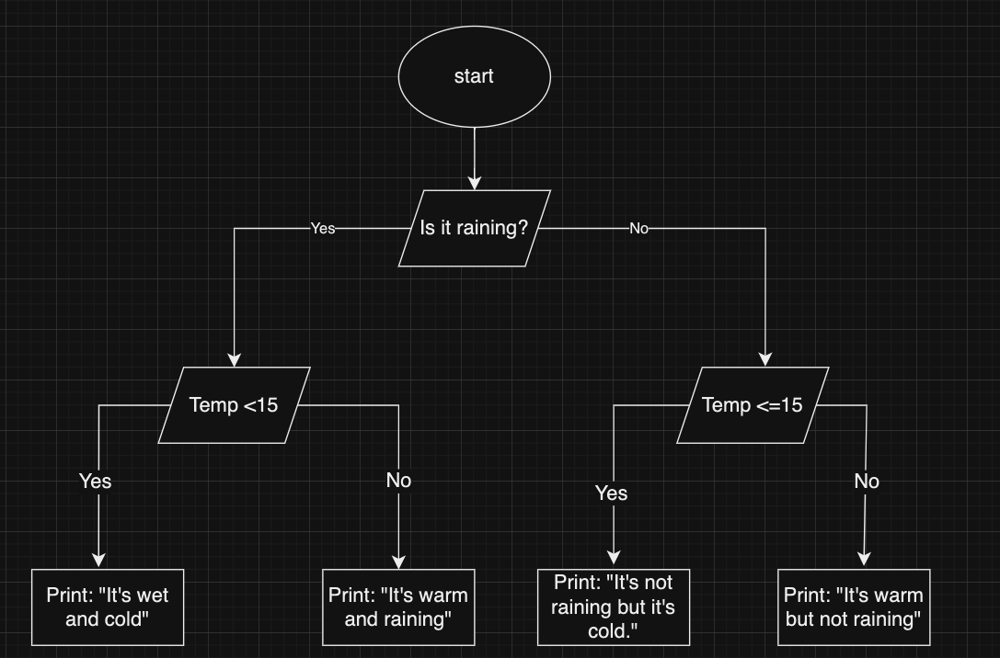

# Reece Doyle T1A1 

## Question 1

    Identify and explain common and important components and concepts of web development markup language

***

In web development, a markup language is the used to create a website. The markup language itself does not appear on the screen, but it does handle the formatting and structure of the website. The markup language gives the web browser instructions for what each component of the website therefore how and where it should be displayed. (p101 Hirwade)

Hyper Text Markup Language (HTML) is the most common markup language, however, some others that exist include Dynamic HTML (DHTML), Extensible HTML (XHTML) and Extensible Markup Language (XML). (p104 Hirwade)

The common and important components across these markup languages is the use of a combination of symbols and plain text. HTML is mostly written with the angle brackets<>, where there is an opening set < > and a closing set that adds a backslash </ >. 
A H tag with a number would indicate a heading with a size (1 being the largest) while a P tag would indicate a paragraph. A common example would be < h1 >This is a Heading< /h1> or < p>This is a paragraph< /p>. (p6 Cottrell)

XHTML was an upgraded version of HTML created to fix some of the flaws, mostly relating to syntax. Developers now had to pay more attention to making sure all tags were closed and nested properly, all in lowercase. Attributes applied to a tag had to be in quotation marks. For example, <p id=”main-text”>This is the main paragraph.</p> (p6 Cottrell)


DHTML is a markup language that combines elements of HTML for authoring a website, Cascading Style Sheet (CSS) for styling, and Javascript for programming. It allows the developer to create highly interactive websites. It is sometimes referred to as DOM scripting. (p254 Cottrell)


Hirwade, M., & Hirwade, A. W. (2009). Information technology : A practical manual. Global Media. 

Lee M. Cottrell. HTML & XHTML DeMYSTiFieD. McGraw Hill; 2011. Accessed November 28, 2023. https://search.ebscohost.com/login.aspx?direct=true&AuthType=custuid,ip,uid&custid=ns196358&db=nlebk&AN=347015&authtype=cookie,custuid&custid=ns196358&site=ehost-live
***

## Question 2    
    Define the features of the following technologies that are essential in terms of the development of the internet:
***

 ### Packets

A packet is a small piece of a larger piece of data that has been transmitted across a network from one node to another. The concept was created by a Polish-American researcher named Paul Baran during the cold war (late 1950s to early 1960s). 

His idea was to move away from a centralised ‘hub and spoke’ network topography to a decentralised model. This would remove the central hub as the single point of failure and as a vulnerability. This method would create redundancy should sections of the network be destroyed in a nuclear attack. A piece of data could take many different routes to get from one node to the other. (p14-16 Ryan)

The problem was that digital messages were too large for the network at the time, so bottlenecks and congestion would be frequent, thus making it highly inefficient. To get around the bandwidth limitations, Baran (and at the same time a UK Computer Scientist Donald Davies) worked out that a digital message could be broken into multiple small and efficient ‘packets’ of data that could be sent from one node and reassembled at the other end upon arrival. Each packet could take its own independent route based on whatever was the most efficient path at the time of transmission. (p17 Ryan)

Due to great resistance to the idea, it would ultimately take until 1976 before the first ever packet data transmission occurred, and it was in the car park of a beer garden no less. (p34 Ryan)

Packet switching has become standard practice for the entire internet. The ability for small packets of data to switch routes to the quickest path between nodes, and then reassembling has proven to be the most efficient way to use the available bandwidth on the network, and the best way to get around inevitable faults and shutdowns. (10:10, Harrison et al, CrashCourse Computer Science #28)
***
### IP addresses (IPv4 and IPv6)

An Internet Protocol (IP) Address is a unique number that is assigned to every device on the internet. It is used to keep track of internet activity of billions of users every day. It functions somewhat like the address of your house, or the address of a business. 

IP addresses are needed for the same reason that you need both a send and return address when posting a physical item. When browsing the internet, your device requests the website held on a server at a particular IP address. The server then sends the website back to your device’s IP address. 

Originally in 1983 IP addresses were created using the IPv4 numbering format. This is a 32-bit numbering system containing 4 sets of numbers separated by dots which allows for 4.3 billion unique combinations that can be used as IP addresses. The true scope of what the internet would grow to become would’ve been impossible to predict. The idea of there being 4.3 billion devices connected to the internet would likely have felt like the stuff of science fiction. (Cloudflare, What is my IP address?, 2023)

The introduction of Smart devices and Wifi means we have an “internet of things” and need far more unique IP addresses than ever would’ve seemed possible in 1983. It’s estimated that there are currently more than 10 billion devices connected to the internet and growing. (11:13, Harrison et al, CrashCourse Computer Science #28, 2017)

To solve this problem, IPv6 was created. IPv6 is a 128-bit format number consisting of 8 groupings of 4 letters or numbers separated by colons. This allows for a 39 digit number of unique IP addresses, as well as some upgrades in security and privacy. (Cloudflare, What is my IP address?, 2003)
***

### Routers and Routing

In the context of a network, routing is the path that data packets take to get from one device to another. Routers are the network hardware that forwards and receives the data packets. They determine the most efficient path to send data packets. In small networks, there might be a static path that is always the same. However, for larger and wider spanning networks routers use routing tables to determine the most efficient route for data to get to its destination, not unlike how a GPS navigator will dynamically direct a car based on its location. This could be through multiple servers, across multiple networks, even across multiple countries involving millions of data packets and millions of decisions per second. (CloudFlare, What is routing?, 2023)
***

 ### Domains and DNS

“The Domain Name System (DNS) is the phone book of the Internet.” (CloudFlare, What is DNS?, 2023)

DNS allows people to remember a domain name rather than memorise and IP address. When attempting to load a webpage into a browser, the user will likely use a Uniform Resource Locator (URL) consisting of the Scheme (http:// or https://) and at least the domain name (www.example.com). (MDN, What is a URL?, 2023)

This sends a request to the organisations DNS Server, which consists of multiple machines and multiple processes that delivers the IP address of the website the user requested. Using the user’s IP address as the destination, the DNS server sends back the IP address of the website. This IP address is then used to retrieve and display the website the end user was looking for. This is an entirely different server from the DNS server. (CloudFlare, DNS server types, 2023)
***

### Explain how each technology has contributed to the development of the internet.


Each of these technologies has contributed significantly to the development of the internet. Packet switching in conjunction with routers and routing has made transferring packets of data efficient and fast over inexpensive and fault-resistant networks. Without them, congestion would make the internet unusable. IP addresses have created an efficient method for devices to find each other on the internet quickly. DNS has made the internet user friendly to the largest possible number of people. Without it, people would have needed to remember many complex IP addresses which would’ve slowed down the adoption of the internet’s development. 
***

Ryan, Johnny. A History of the Internet and the Digital Future, Reaktion Books, Limited, 2010. ProQuest Ebook Central, https://ebookcentral.proquest.com/lib/redhill-ebooks/detail.action?docID=618772.

Harrison, Dr. Chris and Ogan, Dr. Amy, Computer Networks: Crash Course Computer Science #28, CrashCourse, 14 September 2017, https://www.youtube.com/watch?v=3QhU9jd03a0

Cloudflare, What is my IP address, What is an IP address and why does it matter?, 2023, https://www.cloudflare.com/en-au/learning/dns/glossary/what-is-my-ip-address/

Cloudflare, What is DNS? | How DNS works, 2023, 
https://www.cloudflare.com/en-au/learning/dns/what-is-dns/

MDN Web Docs, What is a URL?, 2023, https://developer.mozilla.org/en-US/docs/Learn/Common_questions/Web_mechanics/What_is_a_URL

CloudFlare, DNS Server Types, What are the different types of DNS server?, 2023, https://www.cloudflare.com/en-au/learning/dns/dns-server-types/

CloudFlare, What is routing? |IP routing, 2023, https://www.cloudflare.com/en-au/learning/network-layer/what-is-routing/
***

## Question 3	
    Define the features of the following technologies that are essential in terms of the development of the internet:
     - *TCP*
    - *HTTP and HTTPS*
    - *web browsers (requests, rendering and developer tools)*

    Explain how each technology has contributed to the development of client and server communication over the internet (50 - 150 words for each technology)**
***

### TCP 
Transmission Control Protocol (TCP) is the standard that allows communication between different machines and is what makes packet switching viable. While it is IP addresses and packet switching that allows us to break data down into smaller pieces to send through the most efficient route on the network, it is TCP that is responsible for putting the packets in the right order and acknowledging back to the sender that the data packet was received. This is why we usually see it expressed as TCP/IP, as the two technologies are integral to each other. (Fisher, 2019)

TCP achieves it's goal of reassembling data packets by assigning a number to each of the packet as it is sent. This allows the receiving machine to reassemble the data in the right order, not unlike putting together a puzzle. (05:49, Harrison et al. Crash Course Computer Science #29, 2017)

Once the data packet is received, the receiver sends back an acknowledgement. The downside of this is that the acknowledgement might be as big as the packet itself, thus doubling the amount of bandwidth required, however the positives outweigh the negatives for most applications.(07:31, Harrison et al. Crash Course Computer Science #29, 2017)

The sending computer can send multiple copies of the same data packet to make sure the whole piece of data is received. This might occur when there has been a lag in the time between the send and the acknowledgment. Therefore, the sending computer will sense the lag, and can throttle it's transfer speed to not waste bandwidth. (06:11, Harrison et al. Crash Course Computer Science #29, 2017)

The sender is able to send multiple packets at a time. If the receiving computer receives any duplicate data packets, it can simply discard them. 
 

Fisher, Sharon, What is TCP/IP and How Does It Work?, 30 July 2019, https://www.avast.com/c-what-is-tcp-ip#:~:text=What%20does%20TCP%2FIP%20stand,network%20such%20as%20the%20internet.

Harrison, Dr. Chris and Ogan, Dr. Amy, Computer Networks: Crash Course Computer Science #29, CrashCourse, 21 September 2017, https://www.youtube.com/watch?v=AEaKrq3SpW8

***
## HTTP and HTTPS
Hyper Text Transfer Protocol (HTTP) is the method used to send requests for pages from the Client to the Server.  

Once DNS has established the IP address of the server I'd like to contact, my computer uses HTTP to send a GET request. What returns is the a series of data packets that are put back in order using TCP. This usually would reveal some HTML, CSS and Javascript that tells my computer how to display the contents of the webpage I'm wanting to view. (CloudFlare, What is HTTP?, 2023)

The issue with HTTP was that it passed GET requests that contained a lot of sensative data like bank logins and passwords. If a hacker were to intercept GET requests, they would receive your data in plain text. Very easy to read and exploit. 
The password information being intercepted would be as easy to read as this:

```username: username```

```password: 123456```

This is why we needed HTTPS.

Hyper Text Transfer Protocol Secure (HTTPS) is the updated version of HTTP, which added encryption for added security when browsing. (CloudFlare, What is HTTPS?, 2023)

With the encryption technology of HTTPS, that same username and password might look like this:

```t8Fw6T8UV81pQfyhDkhebbz7+oiwldr1j2gHBB3L3RFTRsQCpaSnSBZ78Vme+DpDVJPvZdZUZHpzbbcqmSW1+3xXGsERHg9YDmpYk0VVDiRvw1H5miNieJeJ/FNUjgH0BmVRWII6+T4MnDwmCMZUI/orxP3HGwYCSIvyzS3MpmmSe4iaWKCOHQ== ```

(ClourdFlare, Why is HTTP not secure?, 2023)


CloudFlare, What is HTTP?, 2023, https://www.cloudflare.com/en-au/learning/ddos/glossary/hypertext-transfer-protocol-http/

Cloudflare, What is HTTPS?, 2023, https://www.cloudflare.com/en-au/learning/ssl/what-is-https/

CloudFlare, Why is HTTP not secure? | HTTP vs. HTTPS, 2023, https://www.cloudflare.com/en-au/learning/ssl/why-is-http-not-secure/ 
***

## Web Browsers (requests, rendering and developer tools)

The web browser is the application on a device that sends the requests and renders the respone to show us the website. It is where the end user types in a URL like ```www.example.com``` to view the website they want to see. They're designed to be as intuative as possible so that the novice user can still navigate them with ease. 

The most common web browsers are Google Chrome, Mozilla Firefox, Microsoft Edge, and Apple Safari. As these are all different programs, they will interpret the HTML differently. Thus, a standard had to be developed to allow for as consistent as possible expereience and functionality for all websites, regardless of which browser was being used. (Mozilla, What is a web browser?, 2023)

Developer tools are a program witihin a web browser that allows a developer to see the HTML, CSS and JavaScript that was used to make the website look the way it does. They can use this to debug problems with a website or test how it behaves when changes are made. These are non permanent changes that will only affect the performance while the developer is debugging. Once the website is requested again, it will be back to the original source code. (MDN, 2023)

Mozilla, What is a web browser? 2023, https://www.mozilla.org/en-US/firefox/browsers/what-is-a-browser/

MDN web docs, What are web developer tools? 2023, https://developer.mozilla.org/en-US/docs/Learn/Common_questions/Tools_and_setup/What_are_browser_developer_tools
***


## Question 4
    Identify THREE data structures used in the Python programming language and explain the reasons for using each.
***
## Question 5
	Describe the features of interpreters and compilers and how they are different.
***

## Question 6
	Identify TWO commonly used programming languages and explain the benefits and drawbacks of each.
***

## Question 7
	Identify TWO ethical issues from the areas below and discuss the extent to which an IT professional is ethically responsible in terms of the issue.

    List of topics containing ethical issues:
    - access to a user’s personal information (medical, family, financial, personal attributes such as sexuality, religion, or beliefs)
    - intellectual property, copyright, and acknowledgement.
    - criminal acts such as theft, fraud, trafficking and distribution of prohibited substances, terrorism
    - GPS tracking data and other types of metadata, MAC addresses, hardware fingerprints
    - freedom of thought, conscience, speech and the media
    - aggressive sales and marketing practices designed to mislead and deceive consumers
    - trading of shares on the stock exchange OR crypto-currencies

    For each ethical issue identify a source of legal information relating to the ethical issue and discuss whether the law is helpful in assisting a developer to act in an ethical way. (Word count guide: 200 words max)

    Conduct research into a case study of ONE of the ethical issues you have chosen discuss how an ethical IT professional should respond to the case study and how they might mitigate or prevent ethical breaches. (Word count guide: 400 - 600 words)
***
## Access to a user's personal infromation (medical, family, financial, personal attributes, such as sexuality, religion, or beliefs)

The most obvious wide spanning ethical issue that I believe an IT professional would face is the handling of people’s personal data. Even if I were running even a small business that accepts online payments, I would have a rather large responsibility to ensure that I’m meeting my obligations to protect against a data breech. As a user the leaking of my medical history, who is in my family, my financial position, my sexuality, my religion, beliefs, and world view could have long lasting consequences. 

The Australian Government’s Information Commissioner has published resources to help with the handling of personal information for organisations and government agencies, which can be found here:

https://www.oaic.gov.au/privacy/privacy-guidance-for-organisations-and-government-agencies/handling-personal-information/guide-to-securing-personal-information

This resource contains a lot of information regarding the Privacy Act 1988, and things that need to be considered when securing personal data.  As someone new to this field, this is an overwhelming amount of information to digest at once. Even the subsites that contain more specific information about the acts tell you more about your obligations than the “how” of keeping people’s data safe. 

https://www.oaic.gov.au/privacy/privacy-guidance-for-organisations-and-government-agencies/preventing-preparing-for-and-responding-to-data-breaches/data-breach-preparation-and-response/part-1-data-breaches-and-the-australian-privacy-act#consequences-of-a-data-breach
 
Focusing more on the individual than at a companywide view, I would say that the immediate responsibility of the IT professional at a personal level is to act with care and common sense around people’s sensitive data. Some rules of thumb might be:

* Avoid using a work device on public WiFi wherever possible. 

* Ensure the security of work devices and home WiFi when working from home.

* Use 2 factor authentication with your work devices when possible.

* Updating the software, firmware, and operating systems of your devices regularly.

* Avoid using separate SDD and HDD that can easily be lost or compromised. (That’s what the cloud is for!)

* Keep your login credentials secure and update them regularly. 
***
## Intellectual property, copyright, and acknowledgement.

Minimising piracy is also a major responsibility of IT professionals. This would include, but not be limited to:

* __Properly acknowledging everyone who contributed code to software that is available for purchase.__ 

Much like in music, using someone else’s intellectual property is allowed, only when the proper permissions have been granted, and the all the appropriate parties are acknowledged as authors. The same rights protections extend to the developers of software, websites, and apps. Not doing due diligence or acting without integrity in the development phase could lead to some costly legal issues in the future, therefore it is prudent for the developer to always have the correct permissions from copyright holders.

* __Using pirated software at all, but especially in a professional setting.__


It is illegal to use pirated software, and using it in a professional setting should be discouraged.  Relying on cracked software leaves you at the mercy of the pirate and their ability to get all the features of the software working reliably. This means that the troubleshooting guides that are common within user communities may not apply to any technical issues you’re having with your stolen software. This leads to lost hours, and lost hours leads to lost productivity. The cost of losing a big client will likely cost you more than just purchasing the software would’ve cost you in the first place. You’re also leaving yourself open to vulnerabilities that are found and patched throughout a product’s lifecycle. 

The Australian Copyright Act 1968 can be found here. 

https://www.austlii.edu.au/cgi-bin/viewdb/au/legis/cth/consol_act/ca1968133/


Once again, with a lack of industry experience, it’s hard to determine where the legislation above meets the ‘how’ of ethical use and piracy. Along with all of the personal level responsibilities mentioned above that applied to keeping personal data secure,the addition of the follwoing would also be prudent:
* Check that you have permission to use the code that you haven’t authored yourself
* Follow your organisations guidelines for getting the correct permissions and acknowledge all contributors,
* If it’s impossible to pay for the software you need, use an open source alternative.
* If an open source alternative doesn’t exist, and I was unable to pay for the software I needed, I would have some very serious questions about whether or not I should be creating this kind of content in the first place.

***
    Conduct research into a case study of ONE of the ethical issues you have chosen discuss how an ethical IT professional should respond to the case study and how they might mitigate or prevent ethical breaches. (Word count guide: 400 - 600 words)


A major issue with the illegal distribution of copyrighted material is the use of file sharing and torrent websites like Pirate Bay and Bit Torrent. File sharing made it extremely easy to steal music, movies, cracked software, and any other kind of file that you would previously not have access to for free. 

In a perfect world, everyone would just pay for content and software with no further measures required to protect the rights of the copyright owners. In 2016, the Australian Federal court determined that the best way to combat the prevalence of these websites was to pass the responsibility of blocking access to these illegal sites on the Internet Service Providers. 

https://en.wikipedia.org/wiki/Countries_blocking_access_to_The_Pirate_Bay

After initially blocking access to these sites, the lasws were ammended in 2020 to make them more agile. The producers of content (mostly entertainment based) have the ability to contact ISP's with respawned versions of torrent sites as they appear, and the ISP would be obligated to block access, unless they were to write a lengthy appeal. 

https://www.smh.com.au/technology/federal-court-orders-another-86-piracy-sites-blocked-20200604-p54zii.html

This is only part of the solution. The prevelance of stolen media and cracked software demonstrated a desire for the products being consumed, just not at the price point people were willing to pay. Many entertainment based services moved to a streaming and subscription model. With the ever increasing bandwidth and availability of NBN and broadband internet services, it was now not only more convienient to just stream content straight from the internet without the files first needing to be downloaded, it became the prefered method. The realtively small monthly price provided great value for the consumer, as they no longer had to risk downloading poor quality content or viruses from torrent websites. 

This model has also been applied to many software based services that a profesional may find themselves using. For example, Adobe Creative Cloud allows profesionals access to only the programs they need, and for a fraction of the upfront cost of buying the software outright.

Many websites have moved to a web based service as well. Sites like Figma allow a subscription based model where the professional user gets who gets all the tools they need to work some cloud storage all online. A user can log into a site on any device and work from anywhere where there is an internt connection. 

Despite this, these illegal websites can still be accessed through various methods, such as changing the DNS or using VPNs. While this may be very easy for a professional to make use of these illegal websites to get cracked software, as stated above, it is poor practice to do so. 

At a personal level, it is best to take advantage of trial periods for software you're evaluting. Make a decision, but factor in if you can afford the software outright, or consider if it's available in a subscription model, or if there is an opensource option. 

If you were to find that your employer was using cracked software as part of their business practice, it would be worth pointing out that what they're doing is illegal. They're opening the business up to vulnerabilities, and potential functionality issues that could end up costing more money than they're saving. You could point out that there are many affordable alternatives to most software available, or subscription services to mitigate the initial outlay. Even opensource software. If this fell on deaf ears, it may be a good time to consider whether the attitudes of your employer are in line with your own, and where you see yourself in the future. 

## Question 8
    Explain control flow, using examples from the Python programming language.
***

## Question 9
    Explain the difference between type coercion and type conversion. Are either used in Python?
Python doesn't use type coercion.
***

## Question 10
    Explain data types using examples
***

## Question 11
    Here’s the problem: “There is a restaurant serving a variety of food. The customers want to be able to buy food of their choice. All the staff just quit, how can you build an app to replace them?”
    - Identify the classes you would use to solve the problem
    - Write a short explanation of why you would use the classes you have identified

## Question 12

    Identify and explain the error in the code snippet below that is preventing correct execution of the program.
```python
celsius = int(input())

fahrenheit = (celsius*9/5)+32

print(f"The result is: {fahrenheit}.")
```

The first error is that it's not clear what this program does, because there's no instructions. 

Even if you know that this is a celsius to Fahrenheit converter, there is still an error. 

The input type isn’t defined and therefore is defaulting to a string.


The input needs to be defined as an integer. 

You do this by changing line 1 to:

```celsius = int(input())```

 The program can then be improved by adding some instructions:

```celsius = int(input("Enter the temperature in celsius:"))```

The finished code looks like this:

```python
celsius = int(input("Enter the temperature in celsius:"))

fahrenheit = (celsius*9/5)+32

print(f"The result is: {fahrenheit}.")
```

***
## Question 13
    The code snippet below looks for the first two elements that are out of order and swaps them; however, it is not producing the correct results. Rewrite the code so that it works correctly.
***
```python
numbers = [5, 22, 29, 39, 19, 51, 78, 96, 84]
i = 0
while (i < len(numbers) - 1) and (numbers[i] < numbers[i+1]):
    i += 1
print(i)
numbers[i] = numbers[i+1]
numbers[i+1] = numbers[i]
```
***
While this code doesn’t show any errors, it is not outputting the information we need. The goal of the code is to reverse the order of index 3 (39) and index 4 (19) of the numbers array and print the whole the new order of: 

```[ 5, 22, 29, 19, 39, 51, 78, 96, 84 ]```

This program currently returns an answer of ‘3’. 

This is because of the ```print(i)``` 

In line 2 we establish that ```[i] = 0```

The two statements in the ```while``` loop on line 3 are ```True```. 

```(i  <  len(numbers) – 1)```

The len function returns the number of items in an object. In this case, it’s the count of items in the ```numbers``` array, which is 9. Therefore:

```
(i  <  len(numbers) – 1)

= (0 < 9 – 1)

= 0 < 8
```


This is a true statement, so we move to the next statement.

```(numbers[i] < numbers[i+1])```

As ```[i] = 0```, we’re talking about the number in the 0-index position of the ```numbers``` array, which is 5.

```numbers[i+1]```

Adding 0 + 1 gives us index position 1 of the numbers array, which is 22.

So,
```
(numbers[i] < numbers[i+1])

= (5 < 22)
```

This is a ```True``` statement, so we move down to the child.

```[i] += 1```

This adds 1 to the value of ```[i]``` every time the program loops until either statement isn’t true.

It takes 3 loops of the program to return a ```False``` statement, and that is 

```
index 3 < index 4

= 39 < 19.
```
The loop stops, and it prints ‘3’, as that is what the initial code snippet is asking it to do. 

We need to change the command to ```print(numbers)``` and move it to the bottom. 

This prints the array of numbers, but they’re not sorted the way the question asked. 

```print(numbers)``` 

returns 

```[ 5, 22, 29, 39, 19, 51, 78, 96, 84 ]```

We still need to swap 39 and 19 (index 3 and index 4)

```numbers[i] = numbers[i+1] ```is an assignment. At this point in the program, ```[i] = 3```

Therefore, we’re saying index 3 = index 4. 

This overwrites index 3’s 39 with index 4’s 19.

The next assignment is 

```numbers[i+1] = numbers[i]```

At this point in the program, this is irrelevant, because ```numbers[i] = numbers[i+1]``` above already made both numbers the same and ```print(numbers)``` returns:

```[ 5, 22, 29, 19, 19, 51, 78, 96, 84 ]```

To make the code work, we need to “store” that index 3 value before it gets over written. 

I achieved this by adding the assignment of 

```x = numbers[i].```

```numbers[i] = numbers[i+1] ```still turns both index 3 and 4 into 19

```numbers[i+1] = x ```makes index 4 print as the number 39. 

```print(numbers) ```now returns 

```[ 5, 22, 29, 19, 39, 51, 78, 96, 84 ] ```

The Final code snippet looked like this:

```python
numbers = [5, 22, 29, 39, 19, 51, 78, 96, 84]
i = 0
while (i < len(numbers) - 1) and (numbers[i] < numbers[i+1]):
    i += 1

x = numbers[i] 
numbers[i] = numbers[i+1]
numbers[i+1] = x
print(numbers)
```
***

## Question 14
### Demonstrate your algorithmic thinking through completing the following two tasks, in order:
    1. Create a flowchart to outline the steps for listing all prime numbers between 1 and 100 (inclusive). Your flowchart should make use of standard conventions for flowcharts to indicate processes, tasks, actions, or operations

    2. Write pseudocode for the process outlined in your flowchart

I decided to break my flowchart into 2 parts so it's easier to read. 

We start with establishing that ```num = 2```, as 1 isn't a prime number and therefore doesn't need to be checked.

I hit a decision block of ```num <= 100``` because I want the loop to stop when I reach 100. 

The ```Is prime?``` will have its own flowchart. 

If the number is prime, I want it to be printed. If the number is not prime, then it is not printed. Both cases then go throught ```num =+1``` and goes back to the top of the loop. This contiues until we reach 100, then it stops, as all prime numbers have been printed. 


We establish that ```i = 2```
If ```num``` is dividible by ```i```, it will return false and will not be printed. 
Otherwise, we move to the next process which ```=+1``` to ```i```
We then test if ```i < num```. If this is true, we print the number. Otherwise, we go back up and test to see if ```num is divible by i```. If not, it will not print the number as it is not prime. 


***
## Question 15
    You have access to two variables: raining (boolean) and temperature (integer). If it’s raining and the temperature is less than 15 degrees, print to the screen “It’s wet and cold”, if it is less than 15 but not raining print “It’s not raining but cold”. If it’s greater than or equal to 15 but not raining print “It’s warm but not raining”, and otherwise tell them “It’s warm and raining”.
***
To answer this question, I first made a flowchart so I had a clear understanding of what the program needed to execute. 

***
This is the code I ended up with:

```python
raining = True if input("Is it raining? (type yes or no) ").lower() == "yes" else False
temperature = int(input("What is the temperature? "))


if raining == True:
    if temperature <= 15:
        print("It's wet and cold")
    else:
        print("It's warm and raining")

if raining == False:
    if temperature <= 15:
        print("It's not raining but it's cold")
    else:    
        print("It's warm but not raining")
```

***

# Question 16
    ACME Corporation are hiring a new junior developer, as part of their hiring criteria they've created a "coding skill score" based on the specific competencies they require for this role; the more important the skill is for ACME corp, the more points it contributes to the "coding skill score" The skills are weighted as follows:
    - Python (1)
    - Ruby (2)
    - Bash (4)
    - Git (8)
    - HTML (16)
    - TDD (32)
    - CSS (64)
    - JavaScript (128)

    Write a program that allows a user to input their skills and then tells them 
    a) Their overall "coding skill score" 
    b) Skills they may want to learn, and how much each one would improve their score

```python
# I decided to make the skills required a dictionary.
# I decided that the most efficient way to ask about the skills that were needed was simple 'Yes/No' questions. 

coding_skills = {
    "Python" : 1,
    "Ruby" : 2,
    "Bash" : 4,
    "Git" : 8,
    "HTML" : 16,
    "TDD" : 32,
    "CSS" :64,
    "JavaScript" : 128
}

# I created another dictionary that would be populated with the skills that the applicant answered anything other than 'yes' to. This would be printed out after the exam.

missing_skills = {}
user_score = 0

print("Welcome to the ACME Corporation Junior Developer Skills Assessment")

# The 'for' loop would cycle through each of the skills, and the applicant simply had to type 'y' or 'n' for each. If anything other than 'yes' was provided, the skills would be added to the missing skills dictionary to be printed out later. 

# The applicants score was also calculated based on the values in the coding_skills dictionary. The total score was disaplayed at the end. 

for key,value in coding_skills.items(): 
    answer = input("Do you know " + key + "? Y/N: ")
    if answer == "Y" or answer == "y":
        user_score += value
    else:
        missing_skills[key] = value

       
print("Your score is: " + str(user_score))
print("If you had known these languages, your score would have increased by this much: ")
print(missing_skills)
print("Thank you! We'll be in touch!")
```


